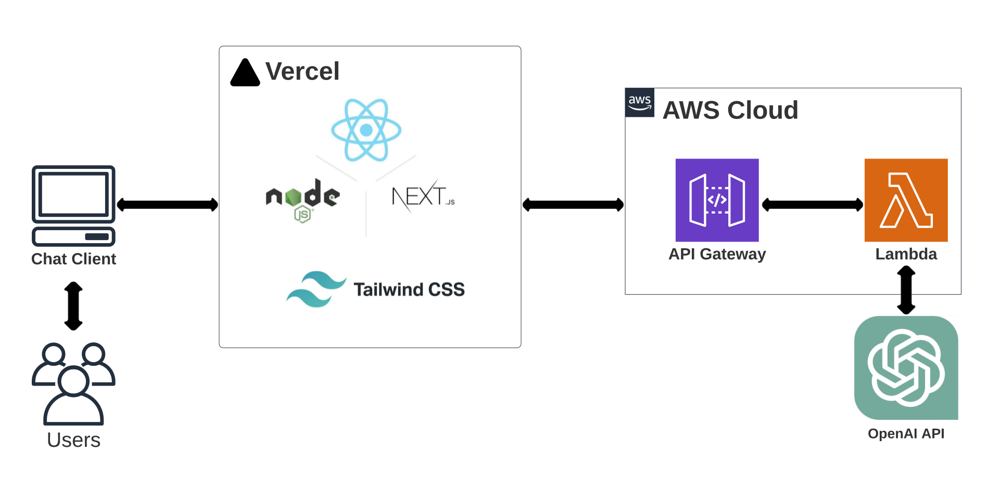

# copykitt 
  
[WebSite](https://copykitt-yl.vercel.app): https://copykitt-yl.vercel.app

## Architecture
A GPT-powered branding snippet genereator

## Preparation
### Python Env
1. I use `Homebrew` and `pyenv` in **macOS** to manage my python versions
2. I create an isolated python environemnt for this project:
    - int the root of this project, run`python3 -m venv .venv`
    to set a `.venv` folder for it and contain needed resources.
    - then I run `source .venv/bin/activate` to activate the virtual env.
    - I can also simply typing `deactivate` to exit the virtual env.

## 3rd Party API
`pip install openai`  
follow [this instruction](https://platform.openai.com/docs/quickstart/step-2-setup-your-api-key) to setup api key and call openai

## Backend Service
### Python application
integrate open ai to build copykkit application

### REST API for app
run `pip install "fastapi[all]"` to install FastAPI, add api layer to copykkit app.

## AWS Lambda Function
### dependencies
1. create AWS Account(if haven't)
2. install AWS CLI
3. install node.js, since it is the backend for AWS CDK.
   - **DO NOT** use Node installer on its web site, since the Node installation process installs npm in a directory with local permissions and can cause __permissions errors__ when you run npm packages globally.
   - instead [install nvm](https://github.com/nvm-sh/nvm#installing-and-updating) and use it to [install node](https://github.com/nvm-sh/nvm#usage), and then update the latest npm by `npm install -g npm`.
4. install AWS CDK `npm install -g aws-cdk`

### IAM user
since having AWS CLI(AWS CLI V2) installed, I then create an IAM Group and attach an IAM user to that group, follow [this tutorial](https://docs.aws.amazon.com/IAM/latest/UserGuide/id_users_create.html#id_users_create_cliwpsapi).

### deploy to cloud(AWS)
create `copykkit-infra` folder to manage the cloud infrastructure.  
Here I used TypeScript to build the project since it's the native language for aws cdk.

1. bootstrap cdk: `aws://{account number}/us-west-1`
2. build and deploy infra: `cdk deploy`, this should be run under the cdk project's root directory.
3. set the lamda function's timeout to be longer since its default value is only 3s `timeout: cdk.Duration.seconds(60)`.

## FrontEnd website
stacks:
1. Node.js + TypeScript
2. React
3. Next.js

### Build FrontEnd with React/Next.js
- run `npx create-next-app copykkit-site --typescript` to bootstrap a next.js project.

- to run local developer server, see [here](./copykkit-site/README.md)

- Deploy it on [Vercel's FrontEnd Cloud](https://vercel.com/)

### Styling the Website
Tailwind CSS has already been integrated when initializing Next.js project.